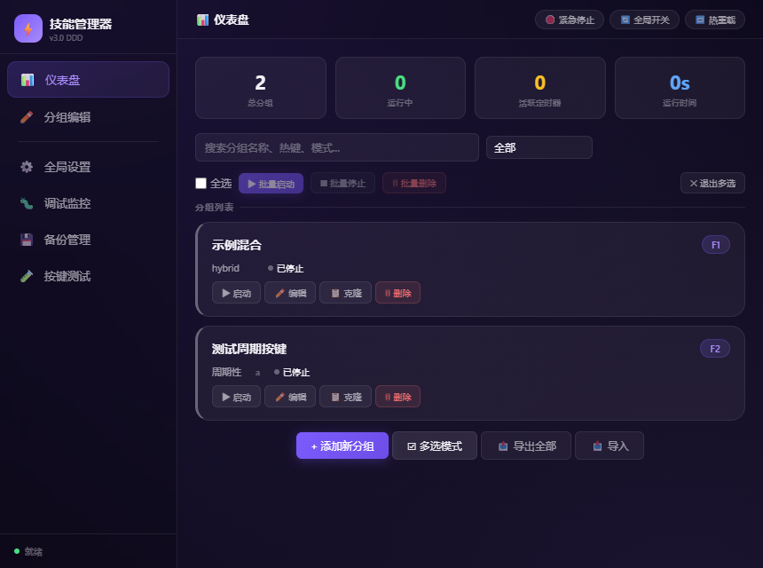
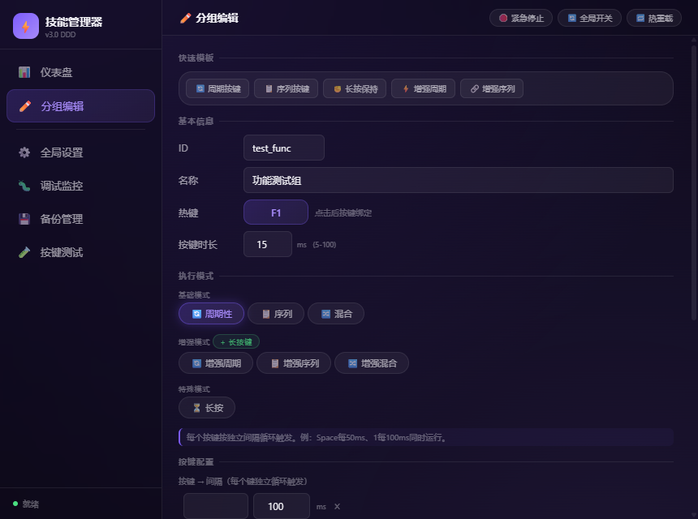
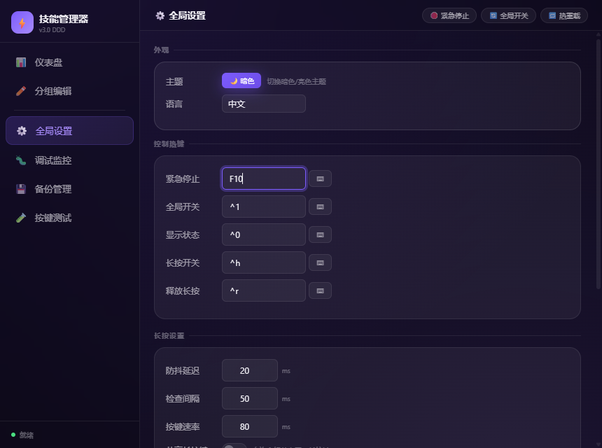
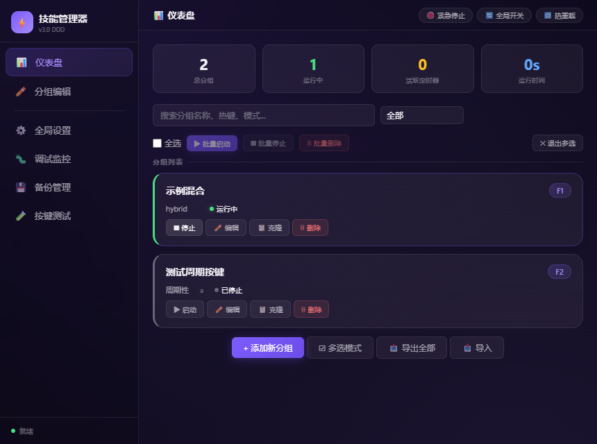

# ASD 技能管理器

一个面向 Windows 桌面的按键连招 / 效率工具：用「分组」组织按键序列（周期性、序列、混合、长按、增强周期、序列、混合、手柄周期、序列、长按共 10 种模式），给每组绑定一个触发热键，在游戏或日常自动化场景里一键触发。

> **版本**：v4.0（开发代号 ASD = Auto Skill Director）  **平台**：Windows 10 / Windows 11  **技术栈**：Rust + Tauri 2.x 前端 + AutoHotkey v2 子进程。

## 它是什么，不是什么

- **是什么**：单机、本地、可离线运行的桌面应用；所有配置（分组、热键、模式参数）保存在你电脑的 `%APPDATA%\com.asd.tauri\config.json`。
- **不是什么**：不是云服务、不联网同步、不上传你的按键数据；不是企业级 SaaS、不承诺 7×24 SLA；不是开源贡献型项目 —— 见下方「许可」一节。

## 许可

本项目以 **GNU 通用公共许可证第 2 版（GPL-2.0-only）** 发布。详见仓库根目录 [`LICENSE`](./LICENSE)。

这意味着：

- 你可以自由运行、研究、修改、再分发本软件；
- 你再分发（含以本软件为基础开发新作品并对外发布）时**必须**以相同许可证发布并保留版权与免责声明；
- **本项目无任何形式的明示或暗示担保**（详见 LICENSE §NO WARRANTY）。

> ⚠️ 本应用**捆绑并依赖** GPL-2.0 协议的 [AutoHotkey v2](https://www.autohotkey.com/)（`ahk_executor/AutoHotkey64.exe`），其许可文本随包附在 `ahk_executor/third-party/AutoHotkey-license.txt`。任何再分发都**必须**同时附上 `THIRD-PARTY-NOTICES.md`。

## 5 分钟上手

### 1. 安装

1. 从本仓库 [`Releases`](../../releases) 页面下载最新 `.msi` 或 NSIS `.exe` 安装包（**注意**：当前唯一可下载的发布产物因工程原因历史最长有效期约 90 天，下载不到时需走源码构建，详见 [`docs/developer-guide.md`](./docs/developer-guide.md) §4.7）。
2. 双击安装包，按提示完成安装。
3. **首次安装可能弹出 WebView2 下载窗口** —— 这是 Tauri 在 Windows 上渲染前端所必需的运行时。**请允许它完成**，否则应用窗口会黑屏或空白。离线 / 无外网环境见下文「前置要求」。

> ⚠️ 如果双击安装包后**什么也没发生**：99% 是 WebView2 未安装且安装器处于「静默下载」模式。详见 [`docs/troubleshooting.md`](./docs/troubleshooting.md) §1。

### 2. 首次启动

启动后你会看到主界面：

界面分三块：左侧导航栏（仪表盘 / 分组编辑 / 全局设置 / 调试监控 / 备份管理 / 按键测试）、右上「紧急停止 / 全局开关 / 热重载」三键、主区域。状态栏底部有圆点表示执行器是否在线。

### 3. 创建第一个分组

1. 仪表盘点 **「+ 添加新分组」** → 进入分组编辑页：

   

2. 顶部「快捷模板」区可一键套用周期 / 序列 / 长按 / 增强周期 / 增强序列。
3. 填：
   - **ID**：英文字母数字短串，作为内部唯一标识；
   - **名称**：显示在仪表盘上的中文友好名；
   - **热键**：右侧点输入框后**按下你想触发的组合键**（如 `F1`），见截图：

   

   热键捕获框接受的是键名文本而非按键事件。
4. 在「执行模式」选 **基础模式**（周期 / 序列 / 混合 / 长按）、**增强模式**（增强周期 / 序列 / 混合）、**手柄模式**（手柄周期 / 序列 / 长按，需要 vJoy 驱动），并填入按键与间隔。
5. 点 **保存** → 自动跳回仪表盘，新分组出现在列表里。

### 4. 启动与停止

仪表盘每个分组卡片右侧有：

- **启动 / 停止**：切换该分组运行状态
- **编辑**：回到编辑页
- **克隆**：复制出一个新分组
- **删除**：删分组（不会删备份）

运行中卡片左侧会出现绿色高亮条，按设定的热键就会触发连招。如需全局暂停，按右上角「**全局开关**」（默认 `Ctrl+1`），或按右上角「**紧急停止**」（默认 `F12`）立即释放所有正在按下的键。

### 5. 备份与恢复（强烈推荐）

任何大改前，去「备份管理」点 **「+ 创建备份」** 一次。备份文件存于 `%APPDATA%\com.asd.tauri\backups\`，每条对应一个时间戳命名的 `.json` 文件。详见 [`docs/user-guide.md`](./docs/user-guide.md) §6。

## 文档索引

| 你想做的事 | 看这里 |
|---|---|
| 完整功能介绍、按部就班学会所有模式 | [`docs/user-guide.md`](./docs/user-guide.md) |
| 装不上 / 起不来 / 按键没反应 / 找不到配置 | [`docs/troubleshooting.md`](./docs/troubleshooting.md) |
| 想自己编译 / 改代码 / 跑测试 | [`docs/developer-guide.md`](./docs/developer-guide.md) |
| 架构决策、设计取舍 | [`docs/adr/`](./docs/adr/) |
| 当前已知缺陷与债项 | （**注意**：测试数字唯一权威在 `asd-tauri/docs/test-map.md`，由 Tessa 维护；债项唯一登记处由主理人维护；不在本 README 复制） |

## 前置要求

| 项 | 要求 | 缺失时表现 |
|---|---|---|
| 操作系统 | Windows 10 1809+ / Windows 11 | 应用根本不启动 |
| WebView2 Runtime | 必需 | 安装器会自动下载；若被禁用 / 离线，会出现「装了但起不来」 |
| vJoy 驱动 | **仅手柄模式需要** | 选手柄模式但未装 vJoy 时，按键发不出去，控制台会报错 |
| AutoHotkey v2 | **应用已自带**，无需另行安装 | 不适用 |

## 不承诺

- 本应用**不提供**任何形式的可用性 / 数据安全承诺。
- 配置与备份文件存于你电脑本地，**重装系统、清理 `%APPDATA%`、误删 `com.asd.tauri` 目录**都会导致配置丢失 —— **请定期用「备份管理 → 导出全部」保存一份到非系统盘**。
- 测试覆盖率与已知缺陷请查阅 `asd-tauri/docs/test-map.md` 与 `docs/tech-debt-register.md`（注意：本文不复制数字，避免漂移）。