# 图谱式开发流程规范

> **文档定位**：本项目「开发流程」的唯一权威。
> **适用范围**：主线 **v4.0**（Rust/Tauri 宿主 + AHK 执行器子进程）。v3.0 独立运行模式的差异以 `> **v3.0 差异**` 注记块标注在对应章节内。
> **维护要求**：本规范**不持有任何测试数字**，所有测试统计请查 `asd-tauri/docs/test-map.md`。

---

## 目录

- [第 0 章 前言：权威层级与使用方式](#第-0-章-前言权威层级与使用方式)
- [第 1 章 项目目录结构说明](#第-1-章-项目目录结构说明)
- [第 2 章 模块间依赖关系图](#第-2-章-模块间依赖关系图)
- [第 3 章 核心功能链路追踪](#第-3-章-核心功能链路追踪)
- [第 4 章 新功能开发与修改的标准流程](#第-4-章-新功能开发与修改的标准流程)
- [第 5 章 代码审查与提交规范](#第-5-章-代码审查与提交规范)
- [第 6 章 文档与图谱同步更新机制](#第-6-章-文档与图谱同步更新机制)
- [附录 A 图谱工具链使用说明](#附录-a-图谱工具链使用说明)
- [附录 B 常见陷阱](#附录-b-常见陷阱)

---

## 第 0 章 前言：权威层级与使用方式

### 0.1 什么是图谱式开发

「图谱式开发」指：**先把代码的真实依赖关系抽成图（节点 = 文件/crate，边 = 真实的 `#Include` / `use` / `import` 语句），再基于这张图做决策**，而不是依赖目录名与直觉。

图上有四类**靶点**，构成日常开发与审查的主要入口：

| 靶点 | 含义 | 为什么危险 |
|------|------|-----------|
| **环** | A 依赖 B，B 又依赖 A（Tarjan 强连通分量） | 无法单独测试/复用任一侧；初始化顺序不确定 |
| **逆向边** | 内层依赖外层（如 `infrastructure` 依赖 `domain`） | 违反分层约束，架构会随时间腐化 |
| **孤点** | 无入边也无出边 | 通常是死代码、遗留脚本或漏加 `#Include` |
| **契约断点** | 跨进程/跨语言的同名契约不一致（IPC variant、命令名、配置字段） | 编译期无感，只在运行时爆炸 |

本规范的作用是把「怎么建图、怎么看图、看图之后怎么做」固化成可执行流程。

### 0.2 五方文档权威边界

项目文档已形成五份权威，**各自领域内唯一**。任何一份都不应复制另一份的内容：

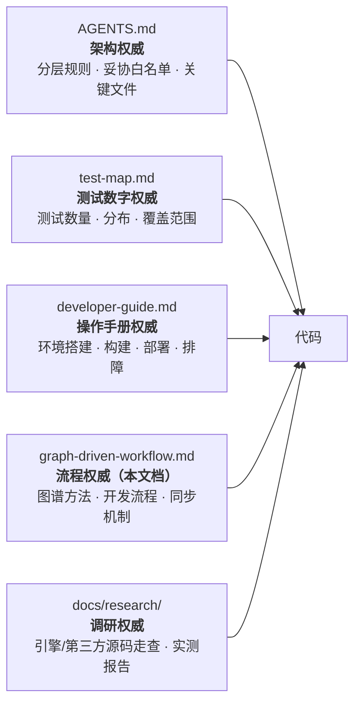

| 文档 | 权威领域 | 明确**不**负责 |
|------|---------|--------------|
| `AGENTS.md` | 架构决策、分层规则、已知妥协白名单、关键文件清单 | 测试数字、操作步骤 |
| `asd-tauri/docs/test-map.md` | **一切测试数字**（函数数、用例数、套件数、覆盖率） | 架构规则、流程 |
| `docs/developer-guide.md` | 环境搭建、构建命令、部署、日常排障 | 分层规则、测试数字 |
| `docs/graph-driven-workflow.md`（本文） | 图谱方法、开发流程、审查流程、同步机制 | 架构规则、测试数字、操作步骤 |
| `docs/research/` | **架构级调研结论**（外部引擎 / 第三方库的源码走查与实测报告）；配套探针在 `tools/ahk-probes/` | 本项目自身的架构规则、测试数字 |

**冲突处置铁律**：若两份文档出现矛盾，按上表所属领域判归属——数字冲突查 `test-map.md`，架构冲突查 `AGENTS.md`，命令冲突查 `developer-guide.md`，流程冲突查本文，外部引擎/第三方调研结论查 `docs/research/`。**发现矛盾必须当场修正**，不允许「两边都留着」。

### 0.3 与其他文档的引用关系

本文档**引用**而不复制以下内容，避免双份维护：

| 本文档章节 | 引用的权威来源 | 引用方式 |
|-----------|--------------|---------|
| §1 目录结构 | `developer-guide.md` §1.1–1.4 | 本规范侧重「职责 + 活跃度 + 约束」；ASCII 目录树见 developer-guide |
| §2 依赖关系图 | `developer-guide.md` §1.5（ASCII 概览版） | **本节为权威分层版**，含 Mermaid 图与反向边白名单 |
| §2 反向边清单 | `AGENTS.md` 两张「已知架构妥协」表 | 图上的逆向边必须与白名单逐条对齐 |
| §5.4 CI 门禁 | `.github/workflows/ci.yml`（**仓库根目录**） | 以 YAML 为准，本节为可读摘要 |

### 0.4 命令约定

本文档中所有命令以**项目根目录**为当前工作目录（`D:\1demo\AutoHotkeydemo`）。文件路径一律使用相对路径且以 `/` 分隔。

Rust 相关命令需先进入 `asd-tauri/`：

```bash
cd asd-tauri && cargo test          # 运行 Rust 测试
```

---

## 第 1 章 项目目录结构说明

> **权威来源**：本节的 ASCII 目录树概览见 `docs/developer-guide.md` §1.1–1.4。本节**不重复**目录树，而是补充三者：**职责划分、活跃度、约束边界**。

### 1.1 顶层目录

| 目录 / 文件 | 职责 | 状态 | 约束 |
|------------|------|:----:|------|
| `main.ahk` | AHK v3.0 主入口：分层 `#Include` + 依赖注入 + 初始化 | 活跃（v3.0） | 必须按 infra → domain → app → presentation 顺序 Include |
| `asd.ahk` | v3.0 兼容别名入口，仅 `#Include "main.ahk"` | 活跃 | 不含逻辑 |
| `config.json` | AHK 侧运行时配置 | 活跃 | 格式须与 Rust `Config` 兼容 |
| `domain/` | AHK 领域层（8 个模块） | 活跃 | 见 §1.2 约束 |
| `infrastructure/` | AHK 基础设施层（15 个模块） | 活跃 | 见 §1.2 约束 |
| `application/` | AHK 应用层（3 个模块） | 活跃 | 见 §1.2 约束 |
| `presentation/` | AHK 表现层（6 个 `.ahk` + 3 个 `.html`） | 活跃 | 见 §1.2 约束 |
| `tests/` | AHK 测试套件（`run_all_tests.ahk` 为总入口） | 活跃 | 归档内容在 `tests/archive/`、第三方库在 `tests/lib/`，**均不参与图谱** |
| `lib/ahk2_lib/` | AHK 第三方库（WebView2 等） | 活跃（外部） | **不参与图谱分析**（`INACTIVE_SEG`） |
| `asd-tauri/` | Rust/Tauri 主工程（5-crate workspace） | 活跃 | 见 §1.3 |
| `docs/` | 技术文档（含本规范、developer-guide、review 归档） | 活跃 | 新增文档须登记到 §6 |
| `logs/` | 运行日志 | 运行期产物 | 不入版本控制语义 |
| `backups/` | 配置备份文件 | 运行期产物 | 由 `BackupService` / `BackupCore` 管理 |
| `config_backup/` | 配置备份目录（历史遗留） | **遗留** | 新逻辑不应写入此目录 |
| `AutoHotkey-2.0.26/` | AHK 解释器源码树 | 只读外部 | **不参与图谱分析**（`EXCLUDE_DIRS`） |
| `.review-analysis/` | 图谱分析脚本与原始数据 | 活跃（工具） | 见附录 A |

> **注**：根目录散落若干 `_diag.ahk` / `_mock.ahk` / `_rt.ahk` / `test_*.ahk` 等调试脚本，属临时产物；如需长期保留请收入 `tests/`，否则会在图谱上表现为孤点（见 §2.5）。

### 1.2 AHK v2 四层架构

AHK v2 部分采用严格 DDD 四层架构，作为 **v3.0 独立运行模式**保留。

| 层 | 目录 | 模块数 | 职责 | 活跃度 |
|----|------|:------:|------|:------:|
| **领域层** | `domain/` | 8 | 纯业务逻辑：技能组、模式注册、按键录制、摇杆执行 | 活跃 |
| **基础设施层** | `infrastructure/` | 15 | JSON 解析/序列化、配置存储、日志、错误系统、IPC 通道 | 活跃 |
| **应用层** | `application/` | 3 | 用例编排：分组服务、配置服务、备份服务 | 活跃 |
| **表现层** | `presentation/` | 6 + 3 HTML | WebView2 / GUI 管理器、AHK-JS Bridge | 活跃 |

#### 1.2.1 领域层模块（`domain/`）

| 文件 | 职责 |
|------|------|
| `interfaces.ahk` | 抽象接口定义（依赖倒置的锚点） |
| `skill_group.ahk` | 技能组领域模型 |
| `skill_manager.ahk` | 技能调度核心 |
| `mode_registry.ahk` | 执行模式注册表 |
| `key_recorder.ahk` | 按键录制 |
| `key_validator.ahk` | 按键校验 |
| `joystick_input.ahk` | 摇杆输入解析（**纯工具类，无副作用无状态**） |
| `joystick_executor.ahk` | 摇杆执行 |

#### 1.2.2 基础设施层模块（`infrastructure/`）

| 文件 | 职责 |
|------|------|
| `json_parser.ahk` / `json_serializer.ahk` | JSON 读写 |
| `json_logger.ahk` / `debug_logger.ahk` / `migration_logger.ahk` | 日志 |
| `error_system.ahk` / `error_handler.ahk` | 错误系统与接管 |
| `config_store.ahk` / `config_io.ahk` / `config_validator.ahk` | 配置存取与校验 |
| `backup_core.ahk` | 备份核心 |
| `ipc_channel.ahk` | IPC 通道 |
| `joy_sender.ahk` / `joy_hotkey_manager.ahk` | 摇杆发送与热键管理 |
| `utils.ahk` | **跨层共享工具入口**（`_GetProp` / `_GetField`） |

#### 1.2.3 应用层模块（`application/`）

| 文件 | 职责 |
|------|------|
| `group_service.ahk` | 分组增删改查编排 |
| `config_service.ahk` | 配置读写编排（含备份调用） |
| `backup_service.ahk` | 备份/恢复编排 |

#### 1.2.4 表现层模块（`presentation/`）

| 文件 | 职责 |
|------|------|
| `webview2_manager.ahk` | WebView2 宿主 + AHK-JS Bridge |
| `ui_manager.ahk` | UI 通用管理 |
| `gui_manager.ahk` | 主 GUI 管理 |
| `group_editor.ahk` / `backup_ui.ahk` / `debug_panel.ahk` | 各功能面板 |
| `app_ui.html` | 主界面（WebView2 加载） |
| `editor_ui.html` / `editor_ui_v2.html` | 编辑器界面（v2 为当前版本） |

#### 1.2.5 AHK 分层约束

依赖方向**必须**由外层指向内层：

```
presentation (depth 3) ──→ application (depth 2) ──→ domain (depth 1) ──→ infrastructure (depth 0)
```

| 规则 | 说明 |
|------|------|
| R1 | 依赖方向只允许「外层 → 内层」，反向边须登记在 §2.4 白名单 |
| R2 | `domain/` 仅允许引用 `infrastructure/error_system.ahk` 的 `LogError`，禁止引用其他 infrastructure 模块 |
| R3 | `infrastructure/joy_hotkey_manager.ahk` 可引用 `domain/joystick_input.ahk`（纯工具类，无副作用） |
| R4 | `infrastructure/joy_sender.ahk` 可反向 `#Include "../domain/interfaces.ahk"`（依赖倒置，仅用于类型继承） |
| R5 | 所有 `.ahk` 文件必须包含错误接管指令（`#ErrorStdOut "UTF-8"` + `OnError`），无例外 |

完整白名单见 §2.4；完整妥协记录见 `AGENTS.md` 的「AHK 已知架构妥协」表。

### 1.3 Rust/Tauri 5-Crate Workspace（`asd-tauri/`）

| Crate | 路径 | 职责 | 活跃度 |
|-------|------|------|:------:|
| `asd-ipc-protocol` | `crates/asd-ipc-protocol/` | IPC 协议定义（13 个 `IpcCommand` variant） | 活跃 |
| `asd-domain` | `crates/asd-domain/` | 领域模型 + trait + 校验器 | 活跃 |
| `asd-application` | `crates/asd-application/` | 应用服务：配置仓库、备份、分组、录制 | 活跃 |
| `asd-test-harness` | `crates/asd-test-harness/` | 测试夹具与 mock（**dev-dependency**） | 活跃 |
| `src-tauri` | `src-tauri/` | Tauri 主 crate：命令 + IPC/看门狗基础设施 | 活跃 |

#### 1.3.1 `src-tauri/src/` 内部结构

| 路径 | 职责 |
|------|------|
| `lib.rs` | 应用初始化 + Tauri 命令注册表（`invoke_handler`） |
| `bridge.rs` | `IpcBridge` / `TauriEventBridge` / `WatchdogBridge`（trait 实现层） |
| `infrastructure/ipc.rs` | `IpcManager` — named pipe 通信 |
| `infrastructure/watchdog.rs` | `ProcessWatchdog` + `WatchdogRunner` — 子进程守护 |
| `infrastructure/logging.rs` | `tracing` 日志初始化 |
| `infrastructure/shutdown.rs` | `try_acquire_shutdown_guard` 纯函数 |
| `commands/` | 5 个命令模块：`config_cmd` / `group_cmd` / `hotkey_cmd` / `recording_cmd` / `system_cmd` |
| `tests/` | 内联集成测试：`ipc_tests` / `config_compat_tests` / `command_contract_tests` / `bridge_tests` / `watchdog_integration_tests` |

#### 1.3.2 ⚠️ 历史占位目录

以下目录**为空**，是 v4.0 早期迁移的遗留占位，**不是**当前架构的一部分：

| 路径 | 状态 | 说明 |
|------|:----:|------|
| `src-tauri/src/application/` | **空 · 历史占位** | 应用逻辑已在 `asd-application` crate |
| `src-tauri/src/domain/` | **空 · 历史占位** | 领域模型已在 `asd-domain` crate |

**注意**：不要向这两个目录添加代码。如需新增应用/领域逻辑，请放入对应 crate。

### 1.4 AHK 执行器（`src-tauri/ahk_executor/`）

Rust 主进程管理的 AHK 子进程，负责按键模拟与热键钩子（**跨进程边界，独立子树**）。

| 文件 | 职责 |
|------|------|
| `executor.ahk` | 命令分发主循环（`CommandDispatcher.Dispatch`） |
| `ipc_client.ahk` | Named pipe 客户端 + `MiniJson` |
| `hotkey_hook.ahk` | 热键钩子注册与回调（**热路径**） |
| `sender.ahk` | 按键发送（周期/序列/增强/长按模式） |
| `joystick.ahk` | 摇杆输入 |
| `asd_executor.bat` | 便携模式启动脚本 |
| `asd_executor.exe` | 编译模式可执行文件 |
| `AutoHotkey64.exe` | AHK 解释器（便携模式使用） |

> **约束**：执行器与其测试**不参与 AHK 四层分层约束**（属 `executor` 层，在 `LAYER_EXEMPT` 中）。

### 1.5 前端与 E2E

| 路径 | 职责 |
|------|------|
| `src/main.js` | Vite 前端入口 |
| `src/api.js` | 前端 API 封装（Tauri `invoke`） |
| `src/` 其余 | 前端页面与组件 |
| `e2e/` | WebDriverIO + tauri-driver 端到端测试 |

> **Rust 前端契约**：`src/api.js` 中调用的命令名必须与 `lib.rs` 的 `invoke_handler` 注册表一致，由 `tests/command_contract_tests.rs` 守护。

---

## 第 2 章 模块间依赖关系图

> **权威来源**：`docs/developer-guide.md` §1.5 提供 **ASCII 概览版**依赖图（面向快速浏览）。**本章为权威分层版**，含 Mermaid 可视化图、反向边白名单与脚本链说明。两者出现不一致时以本章为准。

### 2.1 AHK 分层依赖图

AHK 侧共 **72 个活跃文件**（不含归档/第三方库）。为避免图过大，下图只画**层间的代表模块与分层关系**；逐文件的完整入边/出边清单见 `docs/module-adjacency.md`。

> **口径提示**：此处「72 个活跃文件」是**图谱文件节点数**（含 `entry`/`tests`/`executor` 层，不含归档与第三方库），与 `module-adjacency.md` 的「32 个生产模块」（仅 `domain`/`infrastructure`/`application`/`presentation` 四层）是两个不同口径，不得互相换算或「纠正」。

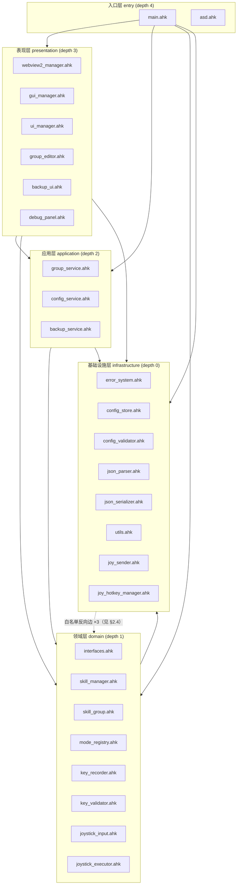

**读图要点**：

- 实线 = 允许的依赖方向（外层 → 内层）
- 虚线 = 白名单内的反向边，**必须**与 `AGENTS.md` 妥协表逐条对齐
- `entry` 层的 `main.ahk` 可依赖任意层（依赖注入职责）

> **v3.0 差异**：本图为 AHK v3.0 独立运行模式的分层图。
> **v4.0 差异**：AHK 侧的 `domain/` `infrastructure/` `application/` `presentation/` `main.ahk` **不参与 v4.0 运行时**——v4.0 的宿主是 Rust 进程（见 §2.2），GUI 是 Tauri 前端。AHK 侧仅 `src-tauri/ahk_executor/` 作为子进程参与。

### 2.2 Rust Crate 依赖图

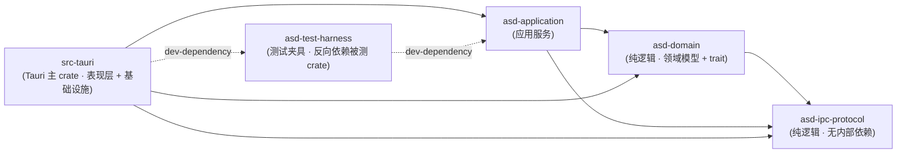

**生产依赖方向（权威）**：

```
asd-ipc-protocol  ←──  asd-domain  ←──  asd-application  ←──  src-tauri
```

| 规则 | 说明 |
|------|------|
| C1 | 纯逻辑 crate（`asd-ipc-protocol` / `asd-domain` / `asd-application`）**禁止**引入 `tauri`、`tokio`、`interprocess`、`windows` |
| C2 | `asd-test-harness` 是唯一允许反向依赖的 crate（其职责就是 mock 被测 crate），且必须以 **dev-dependency** 方式被引用 |
| C3 | 生产依赖方向不得出现环（Tarjan 检测） |
| C4 | trait 抽象（`IpcSender` / `EventEmitter` / `ProcessWatcher`）在 `asd-domain` 定义、在 `src-tauri/bridge.rs` 实现 |
| C5 | `src-tauri` 内部不得再出现 `application/` 或 `domain/` 子模块（见 §1.3.2 历史占位） |

**Rust 侧当前规模**：64 个 `.rs` 文件（不含 `gen/`）、163 条 `use` 边、11 条 crate 边。

### 2.3 Crate 依赖边全表

`build_graph.py` 的 `ALLOWED_CRATE_DEPS` 定义了允许矩阵。当前实际边如下：

| 发起方 | 被依赖方 | 声明位置 | 允许 | 判定 |
|--------|---------|---------|:----:|------|
| `asd-domain` | `asd-ipc-protocol` | 生产 | ✅ | 正常（见 `AGENTS.md` 妥协 #1） |
| `asd-application` | `asd-domain` | 生产 | ✅ | 正常 |
| `asd-application` | `asd-ipc-protocol` | 生产 | ✅ | 正常 |
| `asd-application` | `asd-test-harness` | **dev** | — | 正常（测试夹具） |
| `src-tauri` | `asd-ipc-protocol` | 生产 | ✅ | 正常 |
| `src-tauri` | `asd-domain` | 生产 | ✅ | 正常 |
| `src-tauri` | `asd-application` | 生产 | ✅ | 正常 |
| `src-tauri` | `asd-test-harness` | **dev** | ✅ | 正常（dev-dependency） |
| `asd-test-harness` | `asd-application` | 生产 | ⚠️ | **白名单违规**（夹具职责） |
| `asd-test-harness` | `asd-domain` | 生产 | ⚠️ | **白名单违规**（夹具职责） |
| `asd-test-harness` | `asd-ipc-protocol` | 生产 | ⚠️ | **白名单违规**（夹具职责） |

> **关于 3 处「违规」**：这 3 条边来自 `asd-test-harness/src/lib.rs`，是**测试夹具的设计意图**——夹具必须同时 mock 应用层、领域层与协议层的类型。它们在 `build_graph.py` 中因 `ALLOWED_CRATE_DEPS` 未包含 `asd-test-harness` 的出边而被标为违规，属于**已知且可接受的偏差**。
>
> **重要**：若新增 crate 或新增跨 crate 依赖，**必须同步更新 `build_graph.py` 的 `ALLOWED_CRATE_DEPS`**（见 §6 规则表），否则违例计数会失真。

### 2.4 AHK 反向边白名单（与 `AGENTS.md` 逐条对齐）

图中检测到的**分层反向边共 3 条**，全部在 `AGENTS.md` 妥协表内有登记：

| # | 反向边 | 方向 | 白名单依据 | 约束边界 |
|:-:|--------|------|-----------|---------|
| 1 | `infrastructure/config_validator.ahk` → `domain/joystick_input.ahk` | infra(0) → domain(1) | AGENTS.md 妥协 #1 边界条款 | 仅引用 `JoystickInput` 纯工具函数（无副作用、无状态） |
| 2 | `infrastructure/joy_hotkey_manager.ahk` → `domain/joystick_input.ahk` | infra(0) → domain(1) | AGENTS.md 妥协 #1 边界条款 | 同上；用于消除重复实现（A1 修复） |
| 3 | `infrastructure/joy_sender.ahk` → `domain/interfaces.ahk` | infra(0) → domain(1) | AGENTS.md 妥协 #1 边界条款 | 仅用于类型继承（`JoySender` 实现 `IJoySender`），无副作用无状态 |

> **注**：`domain/*.ahk` → `infrastructure/error_system.ahk` 的 6 条边（`joystick_executor` / `key_recorder` / `key_validator` / `mode_registry` / `skill_group` / `skill_manager`）是**正向边**（domain depth 1 > infrastructure depth 0），属 DDD 层依赖违规但方向正确。该妥协由 `AGENTS.md` 妥协 #1 主条款覆盖，约束边界为「仅允许引用 `ErrorSystem.LogError`」。

**新增反向边的强制流程**：

1. 在 `AGENTS.md` 对应妥协表中登记（含影响文件、说明、约束边界）
2. 确认 `is_reverse_edge` 逻辑不变（`gen_graph_html.py` 的 `LAYER_EXEMPT` 豁免 `entry` / `tests` / `executor` / `other`）
3. 重跑图谱，确认反向边数与白名单条数一致

### 2.5 孤点清单

当前检测到 **9 个孤点**（无入边也无出边）。孤点需逐个人工判定归属：

| 孤点 | 类型 | 建议处置 |
|------|------|---------|
| `SkillMgrDebugLogger.ahk` | 根目录调试脚本 | 移入 `tests/` 或删除 |
| `_mock.ahk` | 调试桩 | 移入 `tests/fixtures/` 或删除 |
| `config.ahk` | 旧配置脚本 | 确认是否已被 `config.json` 取代 |
| `test_ob.ahk` / `test_simple.ahk` / `test_val_btn.ahk` | 临时测试脚本 | 移入 `tests/` 或删除 |
| `ui_manager.ahk`（根目录） | **与 `presentation/ui_manager.ahk` 重名** | 确认是否为遗留副本，优先删除 |
| `tests/legacy/json.ahk` | 遗留测试辅助 | 确认是否仍被引用 |
| `asd-tauri/e2e/fixtures/key_receiver.ahk` | E2E 夹具 | **合理孤点**（由外部 WebDriver 启动，非 `#Include` 关系）→ 建议加入忽略清单 |

> **建议**：在 `build_graph.py` 的 `find_orphans` 调用中为 E2E 夹具等「合理孤点」加 `ignore_no_in` 参数，保持孤点列表的信噪比。

### 2.6 图谱脚本链

图谱由两个脚本组成，**必须按顺序执行**：

```bash
# 第 1 步：扫描源码，生成原始图谱数据
python .review-analysis/build_graph.py
#   → 输出 .review-analysis/graph-raw.json
#   → 控制台打印：文件数 / 边数 / 环 / 孤点 / 违规 / 分层交叉

# 第 2 步：渲染交付物（结构化 JSON + 交互式 HTML）
python .review-analysis/gen_graph_html.py
#   → 输出 docs/review/<date>/graph/architecture-graph.json
#   → 输出 docs/review/<date>/graph/architecture-graph.html
```

#### 2.6.1 关键常量位置

| 常量 / 逻辑 | 所在文件 | 作用 |
|------------|---------|------|
| `INACTIVE_SEG` | `build_graph.py` | 排除非活跃代码（`docs/review/`、`tests/archive/`、`tests/lib/`、`test_output/`、`lib/ahk2_lib/`） |
| `EXCLUDE_DIRS` | `build_graph.py` | 排除目录（`AutoHotkey-2.0.26`、`target`、`node_modules`、`.git`、`dist`） |
| `ALLOWED_CRATE_DEPS` | `build_graph.py` | Crate 依赖允许矩阵 |
| `AHK_LAYERS` | `build_graph.py` | 目录 → 层的映射 |
| `find_cycles` / `find_orphans` | `build_graph.py` | Tarjan 环检测 / 孤点检测 |
| **`LAYER_META`（depth 语义）** | **`gen_graph_html.py`** | 分层 depth 定义与展示元数据 |
| **`LAYER_EXEMPT`** | **`gen_graph_html.py`** | 豁免分层约束的层：`{entry, tests, executor, other}` |

> ⚠️ **常见误判**：分层常量（`LAYER_META` / `LAYER_EXEMPT`）在 **`gen_graph_html.py`**，**不在** `build_graph.py`。修改分层语义时请改对文件。

#### 2.6.2 分层 depth 语义

数值越小越「内层」（越接近纯业务/无依赖）。依赖方向应始终由 depth **大** → **小**。

| 层 | depth | 是否豁免 |
|----|:-----:|:-------:|
| `infrastructure` | 0 | 否 |
| `domain` | 1 | 否 |
| `application` | 2 | 否 |
| `presentation` | 3 | 否 |
| `entry` | 4 | ✅ 豁免（可依赖任意层） |
| `executor` | 5 | ✅ 豁免（独立子树） |
| `tests` | 6 | ✅ 豁免（不参与产品分层） |
| `other` | 7 | ✅ 豁免（未归类） |

#### 2.6.3 HTML 图谱的定位

`architecture-graph.html` 是**交互式补充视图**（可下钻、可按层过滤），适合人工排查。它的路径按审查批次归档在 `docs/review/<date>/graph/` 下，**不内联到本文档**——每次审查生成新快照，本文档只描述方法与判读规则。

---

## 第 3 章 核心功能链路追踪

> **范围**：本章以 **v4.0 主线**（Rust 宿主 + AHK 执行器子进程）为主。每条链路统一采用四段式：**链路目的 → 流程图 → 关键文件锚点 → 变更影响面**。

### 3.1 链路索引

| # | 链路 | 图型 | 触发者 |
|:-:|------|------|-------|
| 3.2 | 应用主启动 | sequenceDiagram | 用户双击 / 系统启动 |
| 3.3 | IPC 通信 | sequenceDiagram | 前端交互 / 内部事件 |
| 3.4 | 按键连招执行 | flowchart ×2 | 热键 / 用户操作 |
| 3.5 | 进程守护与恢复 | flowchart | 心跳超时 / 管道断裂 |
| 3.6 | 配置管理 | flowchart | 前端交互 |
| 3.7 | GUI 渲染（v3.0） | sequenceDiagram | WebView2 加载 |

---

### 3.2 链路：应用主启动（v4.0）

#### 链路目的

从进程启动到「Rust 宿主就绪 + AHK 子进程已连接 + 各后台循环已启动」的完整初始化序列。

#### 流程图

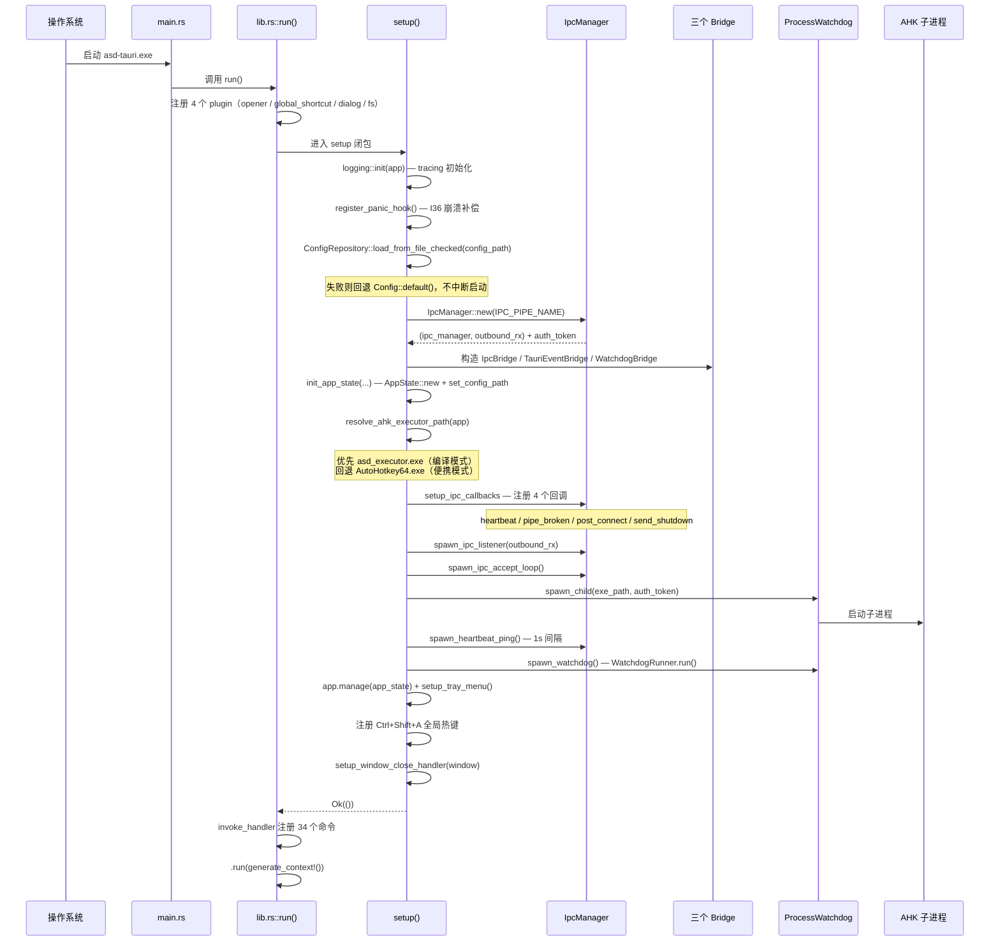

#### 关键文件锚点

| 步骤 | 文件 | 关键符号 |
|------|------|---------|
| 入口 | `asd-tauri/src/main.rs` | `main()` |
| 装配 | `asd-tauri/src-tauri/src/lib.rs` | `run()` / `setup` 闭包 |
| 日志 | `src/infrastructure/logging.rs` | `init(app)` |
| panic 补偿 | `src/infrastructure/watchdog.rs` | `register_panic_hook()` |
| 配置加载 | `crates/asd-application/src/config_repository.rs` | `load_from_file_checked()` |
| IPC 构造 | `src/infrastructure/ipc.rs` | `IpcManager::new()` / `IPC_PIPE_NAME` |
| 桥接 | `src/bridge.rs` | `IpcBridge` / `TauriEventBridge` / `WatchdogBridge` |
| AppState | `crates/asd-application/src/state.rs` | `AppState::new()` / `set_config_path()` |
| 执行器路径 | `src/lib.rs` | `resolve_ahk_executor_path()` |
| 回调注册 | `src/lib.rs` | `setup_ipc_callbacks()` |
| 后台循环 | `src/lib.rs` | `spawn_ipc_listener` / `spawn_ipc_accept_loop` / `spawn_heartbeat_ping` / `spawn_watchdog` |
| 关机 | `src/lib.rs` | `perform_graceful_shutdown()` / `run_shutdown_sequence()` |

#### 变更影响面

| 若你修改… | 必须同步检查 |
|----------|-------------|
| `setup()` 内的初始化顺序 | 锁顺序注释（见下）；`setup_ipc_and_watchdog` 必须先于 `spawn_watchdog` |
| `invoke_handler` 命令列表 | `src/api.js` 命令名；`tests/command_contract_tests.rs` |
| `resolve_ahk_executor_path()` | 便携/编译双模式均需可启动 |
| 新增 plugin | `Cargo.toml` 依赖 + 打包配置 |
| `IPC_PIPE_NAME` | AHK 侧 `ipc_client.ahk` 的管道名（**必须一致**） |

> **⚠️ 锁顺序红线**：`setup_ipc_callbacks` 在持有 `ipc_manager_arc` 锁时获取 `watchdog` 锁。全局锁顺序固定为 **`ipc_manager` → `watchdog`**，`perform_graceful_shutdown` 同样遵守。**反转此顺序将导致死锁**。

> **v3.0 差异**：v3.0 无 Rust 宿主。入口是 `main.ahk`，初始化序列为：按分层顺序 `#Include`（infrastructure → domain → application → presentation）→ 依赖注入 → `WebView2Manager` 启动 → GUI 显示。相应地，§3.3 的 IPC 链路在 v3.0 中是 **AHK 内部** `ipc_channel.ahk` 通信，而非跨进程 named pipe。

---

### 3.3 链路：IPC 通信

#### 链路目的

前端 ↔ Rust ↔ AHK 子进程的双向消息传递。**这是 v4.0 的核心契约面**：任何一处不一致都会在运行时失败。

#### 流程图

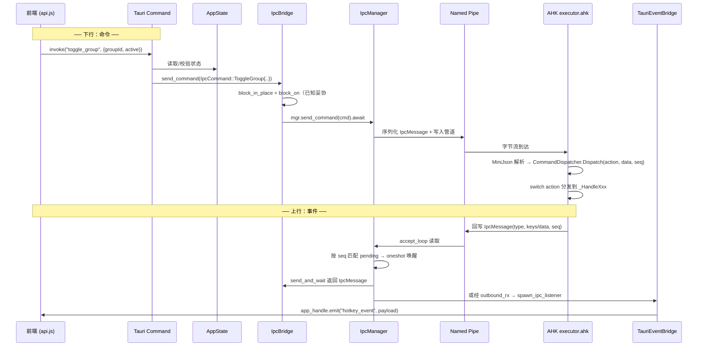

#### 关键文件锚点

| 环节 | 文件 | 关键符号 |
|------|------|---------|
| 前端调用 | `asd-tauri/src/api.js` | `invoke(...)` 封装 |
| 命令入口 | `src/commands/*.rs` | `#[tauri::command]` 函数 |
| 状态 | `crates/asd-application/src/state.rs` | `AppState` / `try_send_ipc_command()` |
| 下行发送 | `src/bridge.rs` | `IpcSender::send_command` / `send_and_wait` |
| 传输 | `src/infrastructure/ipc.rs` | `IpcManager::send_command` / `accept_loop` / `prepare_send_and_wait` |
| 上行分发 | `src/lib.rs` | `spawn_ipc_listener` |
| 事件推送 | `src/bridge.rs` | `EventEmitter::emit`（`TauriEventBridge`） |
| 协议定义 | `crates/asd-ipc-protocol/src/command.rs` | `IpcCommand`（13 variant） |
| 消息构造 | `crates/asd-ipc-protocol/src/message.rs` | `IpcMessage` + 构造器（`ping` / `shutdown`） |
| 执行器接收 | `ahk_executor/ipc_client.ahk` | `IpcClient` / `MiniJson` |
| 执行器分发 | `ahk_executor/executor.ahk` | `CommandDispatcher.Dispatch` |

#### 契约一致性要求

| 契约 | Rust 侧 | AHK 侧 | 守护手段 |
|------|--------|--------|---------|
| 管道名 | `IPC_PIPE_NAME` | `ipc_client.ahk` 常量 | 人工核对（无自动测试） |
| 命令 action 字符串 | `IpcCommand` variant 的 serde 名 | `CommandDispatcher` 的 `case "..."` | **新增 variant 必须双向同步** |
| 认证 token | `ipc_manager.auth_token()` | `IpcClient` 认证逻辑 | 启动时握手 |
| 消息字段 | `IpcMessage` 结构体 | `MiniJson` 解析字段名 | 命名一致 |

> **⚠️ 高频故障点**：`IpcCommand` 有 13 个 variant，而 `CommandDispatcher.Dispatch` 的 `switch` 只显式处理其中 **11 个** action。`Ping` 与 `Shutdown` 走独立路径（心跳/关机内部消息），不经过 `Dispatch`。**新增任何 variant 都必须确认它属于哪一类**，否则会出现「Rust 发了、AHK 不认」的静默失败。
>
> **⚠️ 统计陷阱**：`executor.ahk` 全文共有 **21 个 `case "..."`**，其中 10 个属于**模式字符串** switch（`periodic` / `sequence` / `enhanced_periodic` / `enhanced_sequence` / `hold` / `hybrid` / `enhanced_hybrid` / `joystick_periodic` / `joystick_sequence` / `joystick_hold`，用于 `MergeModeConfig`），**与 IPC action 无关**。对比契约时不要用 `grep -c 'case "'` 全文件计数——必须限定在 `Dispatch` 函数范围内（见 `docs/graph-sync-checklist.md` §5 的正确命令）。

#### 变更影响面

| 若你修改… | 必须同步 |
|----------|---------|
| 新增 / 重命名 `IpcCommand` variant | `ahk_executor/executor.ahk` 的 `Dispatch` 分支 + `AGENTS.md` Key Files + test-map.md |
| `IpcMessage` 字段 | `ahk_executor/ipc_client.ahk` 的 `MiniJson` 解析 |
| `IPC_PIPE_NAME` | `ipc_client.ahk` 常量 |
| `send_and_wait` 超时 | 调用方错误处理路径；`pipe_broken` 分支 |
| 新增 Tauri command | `invoke_handler` 注册 + `api.js` + `command_contract_tests.rs` |

---

### 3.4 链路：按键连招执行

> ⚠️ **本链路有两条独立路径，必须区分对待**：**热路径**（用户按下热键，要求低延迟）与**非热路径**（用户在前端点击切换分组，可承受完整校验与日志）。

#### 3.4.1 非热路径：用户操作触发

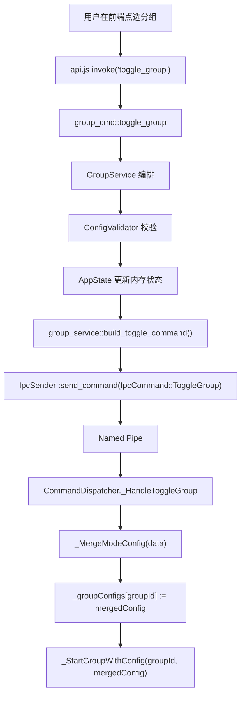

| 环节 | 文件 |
|------|------|
| 前端 | `asd-tauri/src/api.js` |
| 命令 | `src/commands/group_cmd.rs` |
| 编排 | `crates/asd-application/src/group_service.rs`（`build_toggle_command`） |
| 校验 | `crates/asd-domain/src/validator.rs` |
| 状态 | `crates/asd-application/src/state.rs` |
| 分发 | `ahk_executor/executor.ahk` → `CommandDispatcher` |

#### 3.4.2 热路径：热键触发

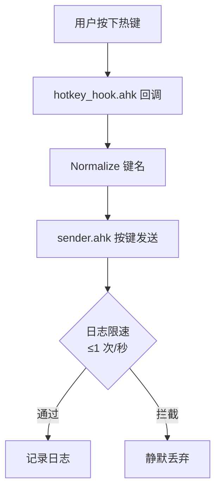

> **⚠️ 热路径约束（性能红线）**：
> - **禁止**在热路径中写重日志——`Execute*` 方法的日志会自动限速，**每秒最多一条**
> - **禁止**在热路径中调用 IPC 或做文件 I/O
> - 热路径的独立子树是 `hotkey_hook.ahk` → `sender.ahk`，**不经过** Rust 侧的 `AppState` 或 `GroupService`
>
> **允许的例外**：热键事件通过 `spawn_ipc_listener` 上报给前端用于 UI 展示（`hotkey_event`），这条回程路径**不阻塞**按键执行——`app_state.is_hotkey_registered()` 检查失败时仅记 debug 日志并忽略。

#### 变更影响面

| 若你修改… | 必须检查 |
|----------|---------|
| `Execute*` 方法内的日志 | 限速是否仍生效（≤1 次/秒） |
| `hotkey_hook.ahk` 回调 | 是否引入了阻塞调用 |
| `sender.ahk` 的发送模式 | 四种模式（周期/序列/增强/长按）回归 |
| `_MergeModeConfig` | 与 Rust 侧 `ModeData` 字段兼容 |
| 新增执行模式 | `mode_registry.ahk` + `ModeData` + `executor.ahk` 三处同步 |

---

### 3.5 链路：进程守护与恢复

#### 链路目的

保证 AHK 子进程异常退出/挂起时能自动恢复，且**绝不误伤用户的其它 AHK 进程**。

#### 流程图

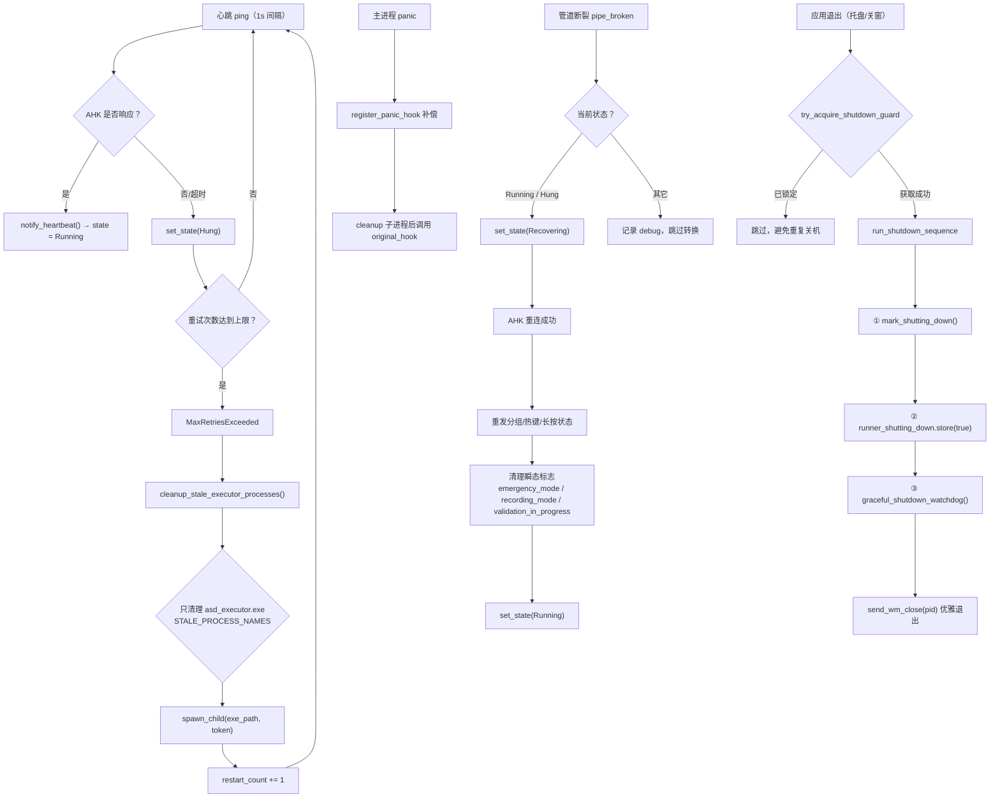

#### 关键文件锚点

| 环节 | 文件 | 关键符号 |
|------|------|---------|
| 看门狗核心 | `src/infrastructure/watchdog.rs` | `ProcessWatchdog` / `WatchdogRunner` |
| 清理红线 | `src/infrastructure/watchdog.rs` | `STALE_PROCESS_NAMES` / `cleanup_stale_executor_processes()` |
| 优雅退出 | `src/infrastructure/watchdog.rs` | `send_wm_close(pid)` |
| panic 补偿 | `src/infrastructure/watchdog.rs` | `register_panic_hook()` / `build_panic_hook_closure()` |
| 关机锁 | `src/infrastructure/shutdown.rs` | `try_acquire_shutdown_guard()` |
| 关机序列 | `src/lib.rs` | `run_shutdown_sequence()` / `perform_graceful_shutdown()` |
| 回调注册 | `src/lib.rs` | `setup_ipc_callbacks()` |
| 状态枚举 | `crates/asd-domain/src/config.rs` | `WatchdogStateEnum` |

#### ⚠️ 安全红线（R1）

`STALE_PROCESS_NAMES` **只允许包含** `asd_executor.exe`。

**绝不允许**加入 `AutoHotkey64.exe` 等通用进程名——`taskkill /F /IM AutoHotkey64.exe` 会杀掉用户系统中所有 AHK 进程（包括用户自己的其它脚本），这是**不可逆的数据/工作损失**。

此约束由 `watchdog.rs` 内的专项测试守护（验证 `STALE_PROCESS_NAMES` 不含 `AutoHotkey64.exe` 且含 `asd_executor.exe`）。

#### Watchdog 状态机

| 状态 | 含义 | 允许的迁移 |
|------|------|-----------|
| `Idle` | 未启动/已停止 | → `Running` |
| `Running` | 正常运行 | → `Hung` / `Recovering` / `Restarting` |
| `Hung` | 心跳超时 | → `Recovering` / `Restarting` |
| `Recovering` | 重连中 | → `Running` / `Restarting` |
| `Restarting` | 重启子进程 | → `Running` |
| `Failed` | 超过重试上限 | → `Restarting`（需手动 `reset_watchdog`） |

#### 变更影响面

| 若你修改… | 必须检查 |
|----------|---------|
| `STALE_PROCESS_NAMES` | **红线测试必须同步更新**，且不得包含通用进程名 |
| 心跳间隔 / 超时阈值 | 必须与 AHK 侧心跳间隔匹配（`AGENTS.md` 陷阱 #6） |
| 状态机迁移规则 | `WatchdogStateEnum` 定义 + 前端状态展示 + 状态同步循环 |
| 重连恢复逻辑 | 瞬态标志清理清单（`emergency_mode` / `recording_mode` / `validation_in_progress`） |
| `send_wm_close` | 失败路径需有强制终止兜底 |

---

### 3.6 链路：配置管理

#### 流程图

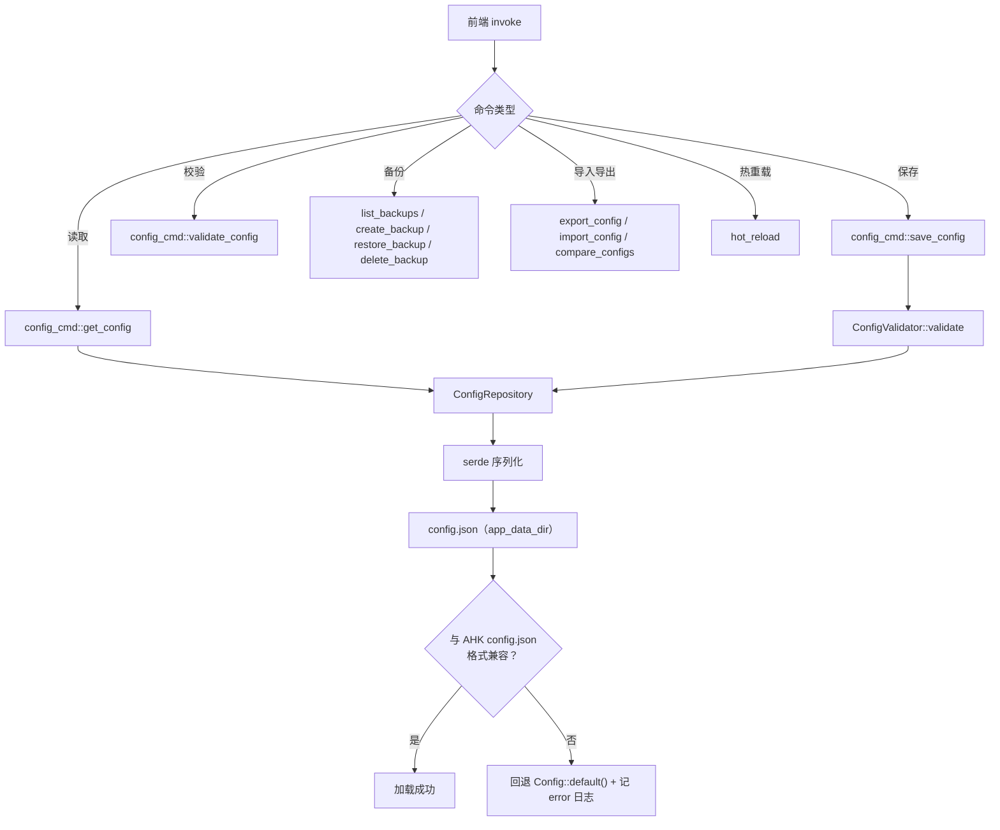

#### 关键文件锚点

| 环节 | 文件 | 关键符号 |
|------|------|---------|
| 命令 | `src/commands/config_cmd.rs` | 11 个 `#[tauri::command]` |
| 仓库 | `crates/asd-application/src/config_repository.rs` | `ConfigRepository::load_from_file_checked` |
| 模型 | `crates/asd-domain/src/config.rs` | `Config` / `GroupConfig` / `ModeData` |
| 校验 | `crates/asd-domain/src/validator.rs` | `ConfigValidator` |
| 备份 | `crates/asd-application/src/backup_service.rs` | `BackupService` |
| 兼容守护 | `src/tests/config_compat_tests.rs` | roundtrip 序列化验证 |
| 样本 | `src-tauri/config.json` | `MAIN_CONFIG_JSON`（经 `include_str!` 引用） |

#### 契约：Rust ↔ AHK 配置兼容

Rust 的 `Config` 结构体必须与 AHK 的 `config.json` 在**字段名与嵌套结构**上完全兼容，否则 AHK 侧读取失败。

守护机制：`config_compat_tests.rs` 使用 `include_str!("../../config.json")` 引用真实配置样本做 roundtrip 序列化验证。**修改 `Config` 结构体后此测试会立即失败**，这是有意的保护。

> **v3.0 差异**：v3.0 的配置持久化走 `ConfigService`（AHK）→ `ConfigStore`（infrastructure）→ `config.json`，并调用 `ExportConfigToJson()` 落盘。**注意**：v3.0 中「配置更改后必须调用 `ExportConfigToJson()` 持久化」，漏调会导致内存状态与磁盘不一致（见 `AGENTS.md` 重要提醒）。

#### 变更影响面

| 若你修改… | 必须检查 |
|----------|---------|
| `Config` / `GroupConfig` / `ModeData` 字段 | `config_compat_tests.rs`；AHK 侧 `config_store.ahk` / `config_validator.ahk` |
| 新增配置项 | 提供默认值（保证旧配置可加载）+ `Config::default()` 同步 |
| 备份逻辑 | `BackupService` + `BackupCore`（AHK）双实现一致性 |
| 新增 config 命令 | `invoke_handler` + `api.js` + `command_contract_tests.rs` |

---

### 3.7 链路：GUI 渲染（仅 v3.0）

> **⚠️ 适用范围**：本节**仅适用于 v3.0 独立运行模式**。v4.0 的 GUI 是 **Tauri 前端**（Vite + `src/api.js`），走 §3.3 的 IPC 链路，**不经过 WebView2Manager**。

#### 流程图

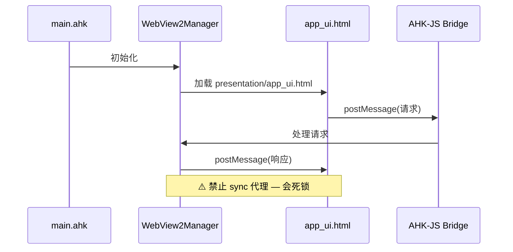

#### 关键文件锚点

| 环节 | 文件 |
|------|------|
| 宿主 | `presentation/webview2_manager.ahk` |
| 主界面 | `presentation/app_ui.html` |
| 编辑器 | `presentation/editor_ui_v2.html`（当前版本） |
| 面板 | `presentation/group_editor.ahk` / `backup_ui.ahk` / `debug_panel.ahk` |
| Bridge 测试 | `tests/test_webview2_bridge.ahk` |

#### ⚠️ 红线：禁止 sync 代理

`hostObjects.sync.ahk.Method()` 在 AHK 消息循环中被调用时会**死锁**。**必须**使用 `postMessage` 异步双向模式。

#### 变更影响面

| 若你修改… | 必须检查 |
|----------|---------|
| Bridge 通信方式 | 是否仍为 postMessage（**不得引入 sync 代理**） |
| HTML 界面 | `editor_ui.html` 与 `editor_ui_v2.html` 的取舍，勿双改 |
| 新增面板 | `presentation/` 下的注册与 `webview2_manager` 的路由 |

---

## 第 4 章 新功能开发与修改的标准流程

### 4.1 开发前：建立图谱基线

**任何功能开发的第一步都是建基线**，否则你无法判断自己的改动是否引入了新问题。

```bash
# 1. 建立基线（记录当前环/孤点/违规数）
python .review-analysis/build_graph.py

# 2. 记录基线值，例如：
#    AHK 环 0 | 孤点 9 | Rust crate 环 0 | 生产依赖违规 3
```

基线值应在提 PR 时与改动后对比。**环数增加 = 必须修复**；**违规数增加 = 必须登记白名单或重构**。

### 4.2 分层决策树

新增代码前，先用下图确定它应该放在哪里：

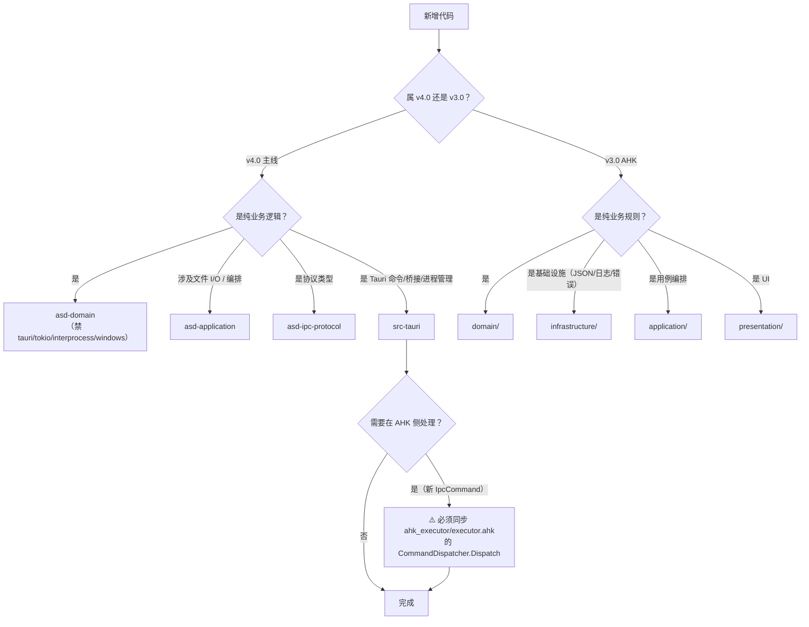

**关键判定**：

| 问 | 答 | 落点 |
|----|----|------|
| 是纯业务逻辑、无 I/O、无异步运行时依赖？ | 是 | `asd-domain` |
| 需要读文件 / 编排多步骤？ | 是 | `asd-application` |
| 是跨进程传输的数据结构？ | 是 | `asd-ipc-protocol` |
| 需要 Tauri API / 进程管理 / trait 实现？ | 是 | `src-tauri` |

### 4.3 新增文件标准动线

#### 4.3.1 AHK 侧

1. **确定层**：按 §4.2 决策树
2. **建文件**：加入对应目录
3. **加错误接管**：`#ErrorStdOut "UTF-8"` + `OnError` 回调（**无例外**）
4. **加 `#Include`**：在 `main.ahk` 的**对应分层段落**内按顺序插入（不得打乱分层顺序）
5. **登记文档**：`AGENTS.md` Key Files + `docs/module-adjacency.md`
6. **跑图谱**：确认无新环；若产生反向边，登记 `AGENTS.md` 妥协表
7. **加测试**：`tests/` 下新建，采用 `AutoHotUnitSuite` + `Test_` 前缀

#### 4.3.2 Rust 侧

1. **确定 crate**：按 §4.2 决策树
2. **建文件**：加入 crate 的 `src/`
3. **声明模块**：在 crate 的 `lib.rs` / `mod.rs` 加 `pub mod`
4. **检查依赖**：若引入新 crate 依赖，**必须**同步 `build_graph.py` 的 `ALLOWED_CRATE_DEPS`
5. **加测试**：单元测试内联 `#[cfg(test)] mod`；集成测试放 `src/tests/`（内联）或 `tests/`（外部）
6. **登记测试数字**：更新 `asd-tauri/docs/test-map.md`（**唯一权威**）
7. **登记文档**：`AGENTS.md` Key Files + 适用时加妥协表
8. **跑门禁**：`cargo fmt --check` + `cargo clippy -- -D warnings` + `cargo test`

### 4.4 修改现有功能的影响面映射

改前先查表，定位**必须一起改**的位置：

| 你改的东西 | 连带必须改 |
|-----------|-----------|
| `IpcCommand` variant | `ahk_executor/executor.ahk` 的 `Dispatch`；`AGENTS.md`；test-map.md |
| `IPC_PIPE_NAME` | `ahk_executor/ipc_client.ahk` |
| `Config` 结构体字段 | AHK 侧 `config_store.ahk`；`config_compat_tests.rs` 样本 |
| `WatchdogStateEnum` | 前端状态展示；状态同步循环；`reset_watchdog` 命令 |
| `STALE_PROCESS_NAMES` | **红线测试**（见 §3.5） |
| Tauri command 增删 | `invoke_handler`；`src/api.js`；`command_contract_tests.rs` |
| `Execute*` 热路径方法 | 日志限速（≤1 次/秒）；不得引入阻塞 |
| AHK 分层常量 (`LAYER_META`) | `gen_graph_html.py`（**不是** `build_graph.py`） |
| crate 依赖 | `Cargo.toml`；`build_graph.py` 的 `ALLOWED_CRATE_DEPS` |
| CI job | `docs/developer-guide.md`；本规范 §5.4 |

### 4.5 Definition of Done — 四闸门

功能完成的判定标准是**四道闸门全绿**：

| 闸门 | 判定 | 命令 |
|:----:|------|------|
| **① 图谱闸门** | 无新增环 / 无未登记反向边 / 无新增孤点 | `python .review-analysis/build_graph.py` |
| **② 质量闸门** | 格式化与静态检查零告警 | `cd asd-tauri && cargo fmt --check && cargo clippy -- -D warnings` |
| **③ 测试闸门** | 全部测试通过，且数字已登记到 `test-map.md` | `cd asd-tauri && cargo test` + AHK `tests/run_all_tests.ahk` |
| **④ 文档闸门** | 按 §6 规则表完成同步 | 见 §6 规则表 |

**未过闸门的功能不算完成**，不得提交 PR。

---

## 第 5 章 代码审查与提交规范

### 5.1 提交信息规范

采用 **Conventional Commits**，格式：

```
<type>(<scope>): <描述>
```

#### 允许的 type（10 种，全小写）

| type | 含义 |
|------|------|
| `feat` | 新功能 |
| `fix` | Bug 修复 |
| `docs` | 文档变更 |
| `style` | 代码风格（不影响逻辑） |
| `refactor` | 重构 |
| `test` | 测试相关 |
| `chore` | 杂项 |
| `perf` | 性能优化 |
| `ci` | CI/CD |
| `build` | 构建系统 |

**描述使用中文**（项目约定）。`!` 可标注 BREAKING CHANGE：`feat(api)!: 移除旧接口`。

#### scope 现状说明（重要）

`commit-msg` 钩子的正则 `(\([a-z-]+\))?` **只校验 scope 的字符形态**（小写字母 + 连字符），**不校验白名单**。

实际 `git log` 中使用的 scope 已**超出** `docs/commit-convention.md` 所列范围（出现如 `review` / `soundness` / `rust` / `ahk-executor` 等）。**当前处置**：以现状为准，不做强制收敛。

**收敛建议（未来可选）**：

| 方向 | 做法 | 代价 |
|------|------|------|
| A. 放宽文档 | 把实际使用的 scope 补入 `commit-convention.md` 白名单 | 最小，但白名单会持续膨胀 |
| B. 收紧钩子 | 在读取 scope 白名单（目前钩子不读）并强校验 | 会打断既有工作流 |
| C. 保持现状 | 仅记录差异，不干预 | 零成本，但 scope 会继续发散 |

**当前采用 C**。若团队决定收敛，建议选 A（先让文档追上现实）。

### 5.2 Git 钩子行为现状

钩子源文件位于 **`scripts/hooks/`**（已纳入版本控制），通过 `core.hooksPath` 生效。

```bash
scripts/install-hooks.sh      # 或 scripts/install-hooks.ps1
scripts/install-hooks.sh --remove   # 取消，恢复使用 .git/hooks
```

> **为什么需要安装步骤**：`.git/hooks/` **不进版本库**，新克隆或换机器后钩子全部失效。
> 安装脚本写入的是**绝对路径**——相对 `core.hooksPath` 会被 git 按「当前工作目录」解析，
> 在子目录里执行 `git commit` 会找不到钩子。

#### `commit-msg`

| 行为 | 说明 |
|------|------|
| 校验对象 | 提交信息第一行 |
| 校验规则 | 必须匹配 `^(feat\|fix\|docs\|style\|refactor\|test\|chore\|perf\|ci\|build)(\([a-z-]+\))?!?: .+` |
| 跳过条件 | 以 `Merge ` 或 `Revert ` 开头的提交 |
| **不**校验 | scope 白名单；描述长度 |

> ⚠️ **陷阱**：scope 正则为 `[a-z-]+`，**不含数字**。含数字的 scope（如 `e2e`、`v2`）会被拒，
> 报错信息与「不在白名单」一模一样，容易误判。报错时先看 scope 里有没有数字。

#### `pre-commit`

执行 4 项检查：敏感文件 / 构建产物 / 大文件（>1MB，仅警告）/ 调试临时文件。

可选：设置 `ASD_FULL_GATES=1` 会在上述检查通过后额外执行 `scripts/check-gates.sh --quick`
（闸门①图谱 + ②fmt/clippy）。默认关闭，避免拖慢提交。

> **提示**：首行超过 80 字符目前**仅警告**，不阻断。

### 5.3 图谱式代码审查流程

本流程复刻 `docs/review/2026-09-12/` 的实践，形成可重复的审查方法。

#### 审查入口：四类靶点

| 靶点 | 检测方式 | 审查动作 |
|------|---------|---------|
| **环** | `build_graph.py` 的 `find_cycles`（Tarjan） | 每个环都必须有明确的打破方案或架构决策记录 |
| **逆向边** | `is_reverse_edge`（内层 → 外层） | 逐条与 `AGENTS.md` 妥协表比对；未登记者必须登记或重构 |
| **孤点** | `find_orphans` | 逐个判定：删除 / 归档 / 加忽略（合理孤点） |
| **契约断点** | 人工 + `command_contract_tests.rs` | 跨进程/跨语言契约双向核对（§3.3 契约表） |

#### 审查步骤

1. **建图**：`python .review-analysis/build_graph.py` → `python .review-analysis/gen_graph_html.py`
2. **取靶点**：读 `graph-raw.json` 的 `findings` 段（环 / 孤点 / 缺失 include / 分层交叉 / 违规）
3. **靶向深读**：只深读靶点涉及的文件，不做全量通读
4. **闭合验证**：对历史发现逐条验证是否已修复
5. **产出报告**：归档到 `docs/review/<YYYY-MM-DD>/`，含图谱快照

#### 报告结构（复用既有模板）

```
执行摘要 → 图谱式分析 → 历史发现闭合验证 → 新发现 → 修复状态与版本对比 → 交付物清单 → 复现方式
```

> **原则**：审查报告只描述**靶点及其结论**，不重复叙述架构（引 `AGENTS.md`）与流程（引本文档）。

### 5.4 CI 门禁与四闸门自动化

#### 5.4.1 CI 配置位置

CI 配置在**仓库根目录** `.github/workflows/ci.yml`。

> ⚠️ **历史坑**：配置曾位于 `asd-tauri/.github/workflows/ci.yml`。
> **GitHub Actions 只读取仓库根目录的 `.github/workflows`**，子目录那份从未被执行过
> （且 `test` job 未设 `working-directory`，在仓库根跑 `cargo` 会因无 Cargo.toml 直接失败；
> 还有 `cargo fmt --all -- --check` 这种多一个 `--` 的错误写法）。
> 已于 2026-09-13 迁移至根目录并修复，子目录那份删除。

| Job | 运行环境 | 触发条件 | 阻塞合并 | 说明 |
|-----|---------|---------|:------:|------|
| `gates` | windows-latest | `push` / `pull_request` | ✅ | **四闸门**，任一红即失败 |
| `coverage` | ubuntu | 仅 `push` | ❌ | `cargo llvm-cov`，`continue-on-error` |
| `miri` | ubuntu | `push` / `pull_request` | ❌ | UB 检查，仅跑纯逻辑 crate |
| `fuzz` | ubuntu | **仅 cron（每周日 0 点 UTC）** | ❌ | 3 个 fuzz target，各 600s |
| `bench` | ubuntu | 仅 `main` 分支 `push` | ❌ | criterion 基准 |
| `e2e` | windows-latest | **仅 `workflow_dispatch` 手动** | ❌ | 需 WebView2 + tauri-driver + msedgedriver |

> 四闸门跑在 windows-latest（AHK 测试必须在 Windows 上跑）；`miri` / `fuzz` 依赖 nightly
> 且 Windows 支持不佳，故留在 ubuntu，两者均为 `continue-on-error`，不阻塞合并。

#### 5.4.2 本地一键跑四闸门

```bash
scripts/check-gates.sh            # 或 scripts/check-gates.ps1（Windows）
scripts/check-gates.sh --quick    # 只跑 G1 + G2（秒级，改代码时频繁跑）
scripts/check-gates.sh --skip-ahk # 跳过 AHK 套件
```

| 闸门 | 校验内容 | 实现 |
|------|---------|------|
| G1 | 无新增环、无白名单外依赖违规 | `scripts/check-graph-baseline.py`（对比 `.review-analysis/graph-baseline.json`） |
| G2 | `cargo fmt --all --check` + `clippy -D warnings` | 直接调用 |
| G3 | cargo test / AHK 套件 / JS 单测 + test-map 数字对账 | `scripts/check-test-map.py` |
| G4 | 文档同步 | 无法自动化，输出人工核对清单 |

G1 的判定策略：**硬失败**仅限环数增加、未解析 `#Include` 增加、出现白名单外新依赖违规；
文件数/边数/孤点数变化**只警告**。基线需更新时：
`python scripts/check-graph-baseline.py --update`（务必人工复核 diff）。

G3 的登记对账分三段：A 文档内部自洽（各章节小计 = 明细之和）、B 各 crate 运行时注册数、
C《汇总》表总数。CI 跑全量；本地 `--quick` 只跑 A。

> **改动 CI 时**：必须同步 `docs/developer-guide.md` 与本规范 §5.4 的表格（见 §6 规则表）。

---

## 第 6 章 文档与图谱同步更新机制

> **本章是最具可执行性的一章**。核心是一张「触发变更 → 必须同步更新」规则表。

### 6.1 同步规则表

**改代码时对照此表，查找必须一并更新的文档：**

| # | 触发变更 | 必须同步更新 | 校验方式 |
|:-:|---------|-------------|---------|
| 1 | 增删 AHK 文件 / `#Include` | `docs/module-adjacency.md`、`AGENTS.md` Key Files | `build_graph.py` 无新环/新孤点 |
| 2 | 新增 `IpcCommand` variant | `ahk_executor` 处理逻辑、`AGENTS.md`、`asd-tauri/docs/test-map.md` | grep variant 双向一致 |
| 3 | 增删测试 / 改测试数 | **`asd-tauri/docs/test-map.md`**（唯一权威） | 重算自洽校验行 |
| 4 | 新增 Tauri command | `AGENTS.md` Key Files、`src/api.js` | `command_contract_tests.rs` + `#[tauri::command]` 计数 |
| 5 | 增删 crate | `Cargo.toml`、`build_graph.py` 的 `ALLOWED_CRATE_DEPS`、本规范 §2.2/2.3 | 图谱无新增违规 |
| 6 | 新增架构妥协 / 反向依赖 | **`AGENTS.md` 两张妥协表** | 图谱逆向边与白名单条数一致 |
| 7 | 改 CI job | `docs/developer-guide.md`、本规范 §5.4 | YAML 与表格一致（CI 只在**仓库根目录** `.github/workflows/` 生效） |
| 13 | 改闸门脚本 / 图谱基线 | `.review-analysis/graph-baseline.json`、本规范 §5.4.2 | `scripts/check-gates.sh` 本地跑通 |
| 8 | 文档结构大改 | 重跑脚本链，归档到 `docs/review/<date>/graph/` | HTML 可打开、JSON 可解析 |
| 9 | 新增顶层目录 / 层 | 本规范 §1.1、`AGENTS.md` Subdirectories | 目录表与实际一致 |
| 10 | 改分层 depth / 豁免规则 | `gen_graph_html.py`（**非** `build_graph.py`）+ 本规范 §2.6.2 | 图谱反向边判定正确 |
| 11 | 改提交规范 / 钩子 | `docs/commit-convention.md`、本规范 §5.1/5.2 | 实测提交一次通过 |
| 12 | 新增/修改 API 命令签名 | `docs/` 下 API 参考文档、`src/api.js` | 契约测试通过 |

### 6.2 同步时机

**铁律：同一 PR 内完成，禁止「代码先合、文档后补」。**

理由：文档滞后会使图谱与代码脱节，后续审查将基于错误的图做判断——这比没有图更危险。

| 场景 | 要求 |
|------|------|
| 功能开发 | 文档改动与代码改动在同一 PR |
| 紧急修复 | 允许同 PR 内先修代码，但**文档改动必须在合并前补齐** |
| 纯文档 PR | 无需代码改动，但需通过 §6.3 校验 |

### 6.3 数字权威单一化

**铁律：测试数字只允许 `asd-tauri/docs/test-map.md` 持有。**

| 规则 | 说明 |
|------|------|
| D1 | 本规范**零测试数字**——任何地方需要数字，一律写「见 `asd-tauri/docs/test-map.md`」 |
| D2 | 其它文档（含 `AGENTS.md`、`developer-guide.md`）引用数字时**必须**标注「以 test-map.md 为唯一权威」 |
| D3 | 改测试后**只更新 test-map.md 一处**；若其它文档出现矛盾数字，**立即删除或改为指针** |

`AGENTS.md` L144 已按此规则标注，可作为范例。

#### 自洽校验模板

`test-map.md` 末尾的自洽校验行必须始终成立：

```
各 crate 明细之和 = 各 crate 小计之和 = 全局汇总
```

修改测试后，请重算此行，确保等式成立。若等式不成立，说明某处漏改。

### 6.4 失效快速自检

怀疑文档或图谱失效时，按顺序执行：

```bash
# ① 图谱是否仍健康（环/孤点/违规是否与基线一致）
python .review-analysis/build_graph.py

# ② 测试数字是否自洽（对比 test-map.md 的自洽校验行）
cd asd-tauri && cargo test -- --list 2>/dev/null | tail -5
cd .. && grep -cE '^\s*#\[(tokio::)?test\]' $(find asd-tauri/crates -name '*.rs') | awk -F: '{s+=$2} END{print s}'

# ③ 契约是否一致（IpcCommand variant ↔ Dispatch 分支）
grep -cE '^\s{4}[A-Z][A-Za-z]+' asd-tauri/crates/asd-ipc-protocol/src/command.rs
grep -cE 'case "' asd-tauri/src-tauri/ahk_executor/executor.ahk

# ④ Tauri 命令数是否一致
grep -cE '^\s+commands::' asd-tauri/src-tauri/src/lib.rs

# ⑤ 文档内路径是否真实存在（抽取 `path.ext` 逐个校验）
```

---

## 附录 A 图谱工具链使用说明

### A.1 前置条件

- Python 3.13（managed 版本路径见项目运行时说明）
- 无需额外第三方包（仅用标准库）

### A.2 三步命令

```bash
# 步 1：建原始图谱
python .review-analysis/build_graph.py
#   输入：项目源码
#   输出：.review-analysis/graph-raw.json
#   控制台：文件数 / 边数 / 环 / 孤点 / 违规 / 分层交叉 TOP15 / 范围外边

# 步 2：渲染交付图谱
python .review-analysis/gen_graph_html.py
#   输入：.review-analysis/graph-raw.json
#   输出：docs/review/<date>/graph/architecture-graph.json
#         docs/review/<date>/graph/architecture-graph.html

# 步 3（可选）：浏览器打开 HTML 做交互式排查
```

### A.3 输出解读

`graph-raw.json` 的 `meta.counts` 段是**基线对比的锚点**：

| 字段 | 含义 | 健康值 |
|------|------|-------|
| `ahk_cycles` | AHK 环数 | **0** |
| `ahk_orphans` | AHK 孤点数 | 0（或全部已判定为合理孤点） |
| `ahk_missing` | 未解析的 `#Include` | **0** |
| `rust_crate_cycles` | crate 环数 | **0** |
| `rust_crate_violations` | 生产依赖违规数 | 与白名单一致（当前 3，均为 `asd-test-harness` 夹具） |

`findings` 段列出每个靶点的**具体条目**（哪个文件、哪条边），用于靶向审查。

### A.4 常见问题

| 现象 | 原因 | 处置 |
|------|------|------|
| AHK 边数为 0 | `#Include` 正则缺少 `re.M` 标志 | 确认 `build_graph.py` L79 保留 `re.IGNORECASE \| re.M`（见附录 B） |
| 循环依赖误报 | 分析了归档/第三方代码 | 检查 `INACTIVE_SEG` 是否覆盖该路径 |
| 新增 crate 后违规数暴涨 | `ALLOWED_CRATE_DEPS` 未更新 | 补入允许矩阵 |
| 孤点太多 | 存在大量临时脚本 | 清理脚本或加入 `ignore_no_in` |

---

## 附录 B 常见陷阱

### B.1 图谱工具链陷阱

| # | 陷阱 | 现状 | 防御要求 |
|:-:|------|------|---------|
| G1 | `#Include` 正则缺 `re.M` 导致 **0 边** | **已修复**（`build_graph.py` 当前为 `re.IGNORECASE \| re.M`） | **必须保留 `re.M`**——正则含 `^` 锚点，缺 `MULTILINE` 时每份文件只能匹配第一行 |
| G2 | 分层常量找错文件 | `LAYER_META` / `LAYER_EXEMPT` 在 **`gen_graph_html.py`**，不在 `build_graph.py` | 改分层语义时确认改的是 `gen_graph_html.py` |
| G3 | dev-dependency 被误判为违规 | `is_violation = (not ok) and not is_dev_only` | 纯测试依赖不计违规；改判定逻辑时保持此语义 |
| G4 | 归档代码污染图谱 | 由 `INACTIVE_SEG` 排除 | 新增归档目录时同步加入 `INACTIVE_SEG` |
| G5 | 循环检测把 `dev-dependency` 算进环 | 环检测只用 `prod_crate_edges` | 保持「仅生产边参与环检测」 |

### B.2 AHK 陷阱

| # | 陷阱 | 说明 |
|:-:|------|------|
| A1 | **箭头函数块体语法错误（致命）** | AHK v2 的 `=>` **只支持表达式体**，不支持 `{ }` 块体。`(args) => { ... }` 会导致 "Missing propertyname: in object literal"。必须用逗号表达式或闭包函数。 |
| A2 | 字符串拼接中的花括号解析错误 | 紧跟变量后的字符串字面量会被解析为对象属性名。用 `Format()`、单引号字符串或分步构建。 |
| A3 | **WebView2 sync 代理死锁** | `hostObjects.sync.ahk.Method()` 在消息循环中调用会死锁。必须用 `postMessage`。 |
| A4 | 热路径日志未限速 | `Execute*` 方法日志自动限速，每秒最多一条。新增日志需确认限速生效。 |
| A5 | 缺错误接管指令 | 所有 `.ahk` 必须含 `#ErrorStdOut "UTF-8"` + `OnError`，无例外。 |
| A6 | 周期性键用 `Mod(A_TickCount, interval)` | 必须使用独立触发时间。 |
| A7 | 定时器引用未存储 | 必须存入 `_timers` Map，否则无法停止。 |

### B.3 Rust/Tauri 陷阱

| # | 陷阱 | 说明 |
|:-:|------|------|
| R1 | 纯逻辑 crate 引入 Tauri 依赖 | `asd-domain` / `asd-ipc-protocol` / `asd-application` 禁止 `tauri` / `tokio` / `interprocess` / `windows` |
| R2 | **新增 `IpcCommand` variant 未同步 AHK** | 必须同步 `executor.ahk` 的 `Dispatch`，否则 IPC 静默失败 |
| R3 | `blocking_lock` 死锁 | `Mutex::blocking_lock()` 在 tokio 异步上下文中可能死锁 |
| R4 | 锁顺序反转死锁 | 全局锁顺序固定为 **`ipc_manager` → `watchdog`** |
| R5 | Config 序列化不兼容 | Rust `Config` 必须与 AHK `config.json` 字段名/嵌套一致 |
| R6 | 管道名不一致 | named pipe 名必须与 AHK 执行器一致 |
| R7 | 心跳超时不匹配 | watchdog 超时须与 AHK 心跳间隔匹配 |
| R8 | **误杀用户 AHK 进程** | `STALE_PROCESS_NAMES` 只允许 `asd_executor.exe`，**绝不**加 `AutoHotkey64.exe` |

### B.4 文档与工程陷阱

| # | 陷阱 | 说明 |
|:-:|------|------|
| D1 | 文档复制数字 | 数字只允许 `test-map.md` 持有（§6.3） |
| D2 | 依赖图双份维护 | `developer-guide.md` §1.5 是概览版，本规范 §2 是权威版——改一处必须检查另一处 |
| D3 | 换行符 | `.gitattributes` 强制 **LF**，新建文档必须 LF |
| D4 | 向空占位目录加代码 | `src-tauri/src/application/` 与 `src-tauri/src/domain/` 是空的历史占位（§1.3.2） |
| D5 | 目录名依直觉判分层 | 必须用 §2.6.2 的 depth 表判定，不要靠目录名猜 |

---

**文档版本**：v1.0
**适用项目版本**：v4.0（主线）/ v3.0（已标注差异）
**相关文档**：`AGENTS.md`（架构权威）· `asd-tauri/docs/test-map.md`（测试数字权威）· `docs/developer-guide.md`（操作手册）· `docs/module-adjacency.md`（邻接表）· `docs/graph-sync-checklist.md`（同步清单）
